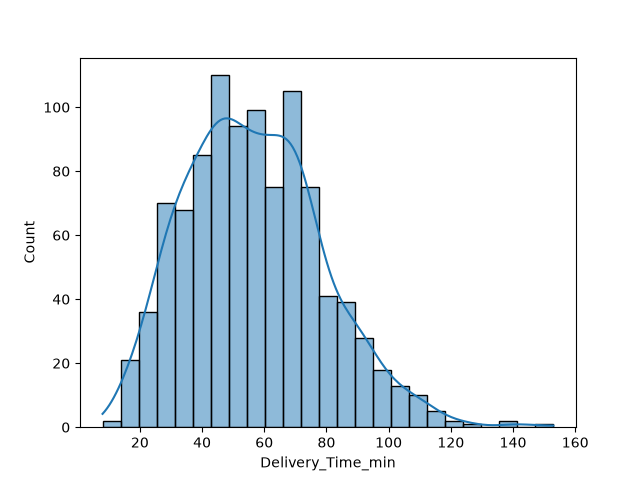
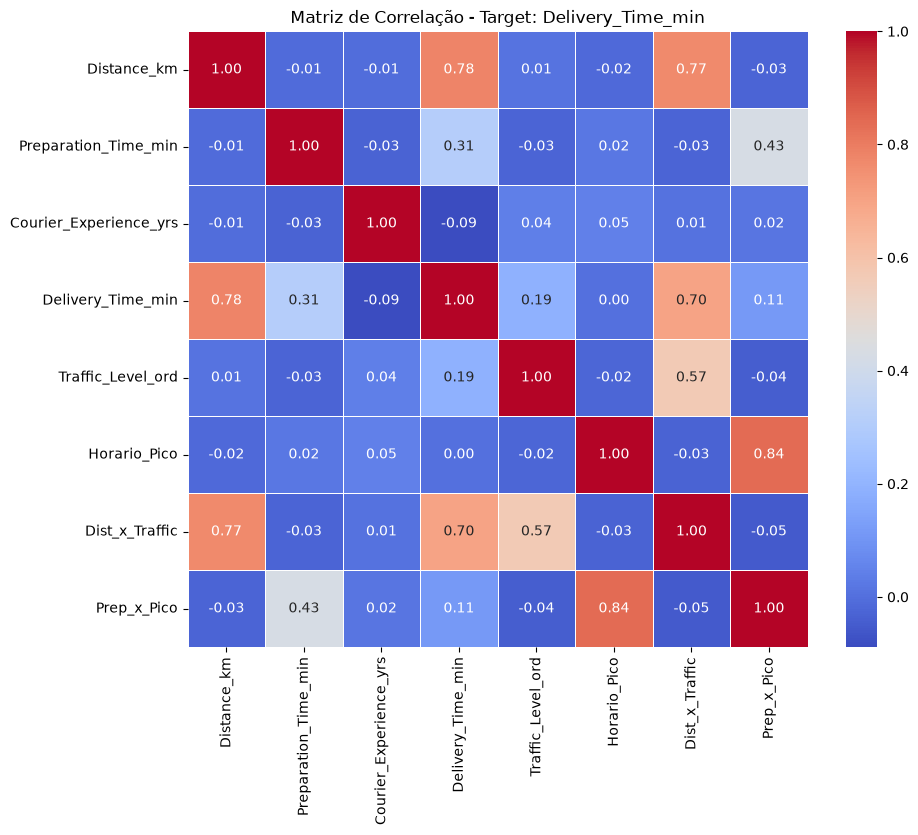
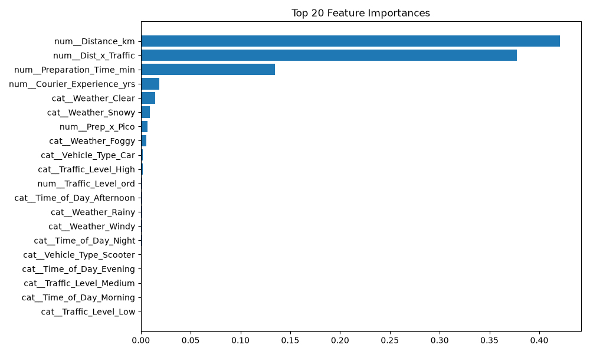

# Predição de Tempo de Entrega de Pedidos em Delivery

Este projeto final, desenvolvido como requisito avaliativo da disciplina de Inteligência Computacional do 7º período do Bacharelado em Sistemas de Informação do Instituto Federal de Alagoas – Campus Arapiraca, tem como objetivo prever o tempo de entrega de pedidos em serviços de delivery a partir de um dataset público disponibilizado na plataforma [Kaggle](https://www.kaggle.com/).

Integrantes:

| Nome                            | E-mail institucional    |
| ------------------------------- | ----------------------- |
| Dionísio Barbosa da Silva Leite | dbsl1@aluno.ifal.edu.br |
| Maria Izabel Lemos da Silva     | mils2@aluno.ifal.edu.br |
| Pedro Henrique Bastos de Brito  | phbb1@aluno.ifal.edu.br |
| Thiago de Almeida Pereira Filho | tapf1@aluno.ifal.edu.br |

## Problema

### Contexto

Em plataformas de delivery de alimentos, informar com precisão quanto tempo um pedido levará para chegar ao cliente é essencial, tendo em vista que estimativas incorretas podem gerar insatisfação, cancelamentos e dificuldades no planejamento logístico das entregas. O tempo total de entrega depende de fatores distintos: distância percorrida, condições climáticas, intensidade do trânsito, horário do pedido, tipo de veículo utilizado, tempo de preparo da refeição e experiência do entregador. Portanto, compreender como essas variáveis influenciam o tempo final permite antecipar atrasos e apoiar decisões operacionais.

### Definição do problema

Dado um conjunto de pedidos com informações sobre rota, ambiente, operação e entregador, o projeto busca **prever o tempo total de entrega em minutos** (`Delivery_Time_min`). Trata-se de um problema de **regressão supervisionada**: a partir de exemplos históricos em que o tempo real de entrega é conhecido, o modelo deve aprender a estimar esse valor para novos pedidos com características semelhantes.

### Objetivo

Construir um modelo de Inteligência Computacional capaz de estimar `Delivery_Time_min` utilizando as variáveis disponíveis no dataset, exceto `Order_ID`, que serve apenas como identificador.

### Entrada e saída

| Papel                  | Variáveis                                                                                                                  |
| ---------------------- | -------------------------------------------------------------------------------------------------------------------------- |
| **Entrada (features)** | `Distance_km`, `Weather`, `Traffic_Level`, `Time_of_Day`, `Vehicle_Type`, `Preparation_Time_min`, `Courier_Experience_yrs` |
| **Saída (alvo)**       | `Delivery_Time_min`                                                                                                        |

## Dados

O dataset original está em `data/raw/food-delivery-times.csv`, sem alterações.

| Informação    | Valor               |
| ------------- | ------------------- |
| Registros     | 1.000               |
| Formato       | CSV                 |
| Variável alvo | `Delivery_Time_min` |

### Variáveis

| Coluna                   | Descrição                        |
| ------------------------ | -------------------------------- |
| `Order_ID`               | Identificador do pedido          |
| `Distance_km`            | Distância da entrega (km)        |
| `Weather`                | Condição climática               |
| `Traffic_Level`          | Nível de trânsito                |
| `Time_of_Day`            | Período do dia                   |
| `Vehicle_Type`           | Tipo de veículo do entregador    |
| `Preparation_Time_min`   | Tempo de preparo do pedido (min) |
| `Courier_Experience_yrs` | Experiência do entregador (anos) |
| `Delivery_Time_min`      | Tempo total de entrega (min)     |

### Tipo de Dados

O dataset contém dois tipos de dados principais: valores numéricos (int e float) e strings categóricas (rótulos) 

| Coluna                   | Tipo                        | Exemplo | Observação |
| ------------------------ | -------------------------------- | -------------------------------- | -------------------------------- | 
| `Order_ID`               | Inteiro (int)| 987 | A coluna `Order_ID` foi removida do treinamento, pois não é uma feature significativa (representa apenas o ID do pedido)
| `Distance_km`            | Ponto flutuante (float) | 13.92 |
| `Weather`                | String categórica (Snowy, Windy, Clear, Rainy, Foggy) | Snowy |
| `Traffic_Level`          | String categórica (High, Medium, Low) | High |
| `Time_of_Day`            | String categórica (Evening, Night, Afternoon, Morning) | Morning |
| `Vehicle_Type`           | String categórica (Bike, Scooter, Car) | Car |
| `Preparation_Time_min`   | Inteiro (int) | 14 |
| `Courier_Experience_yrs` | Ponto flutuante (float) | 7.0 |
| `Delivery_Time_min`      | Inteiro (int) | 88 | 

## Estrutura atual do projeto

```text
food-delivery-time-prediction/
├── data/
│   └── raw/
│       └── food-delivery-times.csv
├── metrics/
│   └── metrics.py
├── models_saved/
│   └── gradient_boosting_model.pkl
│   └── linear_model.pkl
│   └── random_forest_model.pkl
├── src/
│   ├── ingestion/
│   │   └── load_data.py
│   ├── utils/
│   │   ├── constants.py
│   │   ├── exceptions.py
│   │   └── validators.py
│   ├── features/
│   │   └── feature_engineering.py
│   ├── models/
│   │   └── train.py
│   └── preprocessing/
│       ├── clear_data.py
│       ├── data_splitter.py
│       ├── eda.py
│       └── pipeline_preprocess.py
├── tests/
│   ├── conftest.py
│   └── test_*.py
├── .gitignore
├── main.py
├── pytest.ini
├── README.md
└── requirements.txt
```
## Execução

### Pré‑requisitos

- Python 3.10 ou superior
- Git

1. **Clone o repositório**

   ```bash
   git clone https://github.com/pedrohenriquee8/food-delivery-time-prediction.git
   cd food-delivery-time-prediction

2. **Crie e ative um ambiente virtual**

    ```bash
    # Linux / macOS
    python -m venv venv
    source venv/bin/activate

    # Windows
    python -m venv venv
    source venv/Scripts/activate

3. **Instale as dependências necessárias**

    ```bash
    pip install -r requirements.txt

4. **Execute o pipeline:**

    ```bash
    python main.py
    ```

5. **Execute os testes unitários**

    ```bash
    # Executar todos os testes
    pytest

    # Executar com saída detalhada
    pytest -v

    # Executar um arquivo específico
    pytest tests/test_validators.py

    # Executar um teste específico
    pytest tests/test_load_data.py::test_load_data_remove_order_id

## Escolhas de implementação

1. **Python**

    ```bash
    Python 3.12.3

2. **Bibliotecas**

| Biblioteca                   | Uso                        |
| ------------------------ | -------------------------------- |
| `pandas`               | Carregar, manipular e limpar o dataset de pedidos          |
| `numpy`            | Fornecer operações matemáticas e arrays multidimensionais   |
| `matplotlib`                | Gerar gráficos estáticos               |
| `scikit-learn`            | Oferecer os algoritmos de regressão (Linear Regression, Random Forest, Gradient Boosting), pré‑processamento (StandardScaler, OneHotEncoder, SimpleImputer), divisão em treino‑teste, métricas de avaliação (MAE, MSE, R²) e pipelines                   |
| `joblib`           | Salvar e carregar os modelos treinados    |
| `seaborn`           | Visualizações estatísticas  |
| `pytest`           | Executar testes unitários e validar o comportamento dos módulos  |

3. **Método de separação**

Para a realização deste projeto. utilizou-se o método **hold-out**, com divisão 80% para treino e 20% para teste. Essa escolha se justifica devido ao dataset possuir tamanho moderado (994 amostras), permitindo uma partição representativa sem comprometer a quantidade de dados para treinamento. Além disso, o conjunto de teste (cerca de 200 amostras) é suficientemente grande para avaliar as métricas com confiança.

4. **Preenchimento de dados ausentes**

Para preencher os dados ausentes no dataset do projeto os valores numéricos foram substituídos pela mediana, enquanto os valores categóricos foram substituídos pelos valores da moda. A decisão de não deleção das linhas com dados faltantes deu-se pela quantidade significativa de linhas com dados ausentes.

## Resultados obtidos

Com base nisso, realizamos a comparação entre três modelos de regressão (Linear Regression, Random Forest e Gradient Boosting)

| Modelo                  | MAE                       | MSE | RMSE | R2
| ------------------------ | -------------------------------- |  -------------------------------- | -------------------------------- | -------------------------------- |
| `linear`               | **5.58** | **73.80** | **8.60** | **0.85**
| `random_forest`            | 6.45| 92.93| 9.64| 0.81
| `gradient_boosting`    |6.06|89.38|9.45 |0.81

Embora **Random Forest** e **Gradient Boosting** sejam modelos mais complexos, a **Regressão Linear** apresentou as melhores métricas (menor MAE/RMSE e maior R²). Isso pode se justificar:

* As principais variáveis preditoras (Distance_km e Dist_x_Traffic) apresentam forte correlação linear com a variável alvo (r > 0,70).

* A engenharia de features já introduziu a interação mais relevante (Dist_x_Traffic), reduzindo a vantagem das árvores em descobrir interações automaticamente.

* O dataset tem tamanho moderado (~1000 amostras), e modelos complexos como Random Forest e Gradient Boosting, com parâmetros padrão, estão sujeitos a overfitting.

* A análise de importância das features mostrou que a maioria das variáveis tem contribuição marginal (≤ 3%), o que torna a simplicidade da Regressão Linear uma vantagem.

Portanto, **para este problema** e com os dados disponíveis, **a Regressão Linear é o modelo mais adequado**, combinando boa capacidade preditiva com maior simplicidade e interpretabilidade.

### Histograma

A análise da distribuição da variável alvo (`Delivery_Time_min`) revelou que o tempo de entrega varia de 8 a 153 minutos, com **média** de **~55 min** e **mediana** de **~50 min** (aproximadamente), indicando assimetria à direita. Essa calda longa indica a presença de outliers, essa distribuição sugere a necessidade de modelos robustos a outliers (como Random Forest e Gradient Boosting) e justifica a remoção controlada de outliers via IQR somente na variável alvo.



### Matriz de correlação

Com base na matriz de correlação (coeficiente de correlação de Person), pode-se observar que as duas variáveis que possuem **correlações maiores** (isto é, quando uma aumenta a outra também aumenta) são as variáveis `Distance_km` e `Dist_x_Traffic`, com valores de 0.78 e 0.70, respectivamente. Isso demonstra que quanto maior a distância de entrega, maior é o tempo mínimo para realizar a entrega, além disso, o trânsito também faz com o que esse tempo aumente. 

As variáveis que representam **correlações menores** são as `Preparation_Time_min`, `Prep_x_Pico`, `Traffic_Level_ord`, que não influenciam tão fortemente no tempo final de entrega. Além disso, a variável `Horario_Pico` demonstrou que **não** possui relação linear **(0.00)** e `Courier_Experience_yrs` que possui **correlação negativa**.



### Análise da importância das features

Uma análise da importância das features geradas é importante para modelos baseados em árvores (Random Forest e Gradient Boosting), pois revela quais variáveis o modelo considera mais relevantes para fazer suas previsões. Sendo assim, colabora para avaliar se as features geradas agregam realmente valor. As features mais revelantes são **`Distance_km`** e **`Dist_x_Traffic`** demonstrando serem fatores determinantes para o valor da entrega.



## Referências

ALLIBHAI, Jaz.  Hold-out vs. Cross-validation in Machine Learning. Medium, 2018. Disponível em: https://medium.com/@jaz1/holdout-vs-cross-validation-in-machine-learning-7637112d3f8f. Acesso em: 16 jun. 2026.

CLARK, Bryan; LEE, Fangfang. What is gradient boosting? IBM, [s.d.]. Disponível em: https://www.ibm.com/think/topics/gradient-boosting. Acesso em: 16 jun. 2026.

KAGGLE. Kaggle, 2010. Disponível em: https://www.kaggle.com/. Acesso em: 11  jun. 2026.

LEE, Fangfang. Classification versus regression. IBM, [s.d.]. Disponível em: https://www.ibm.com/think/topics/classification-vs-regression. Acesso em: 16 jun. 2026.

ORTEGA, Cristina.  Matriz de correlação: o que é, como funciona e exemplos. QuestionPro, [s.d.]. Disponível em:  https://www.questionpro.com/blog/pt-br/matriz-de-correlacao/. Acesso em: 16 jun. 2026.

PERES, Fernanda F. O que é um outlier?. Blog Fernanda Peres, São Paulo, 16 jan. 2026. Disponível em: https://fernandafperes.com.br/blog/outliers/. Acesso em: 16 jun. 2026.

TALKS, Laura Data. Regressão Linear?. Medium, 2020. Disponível em: https://medium.com/@lauradatatalks/regress%C3%A3o-linear-6a7f247c3e29. Acesso em: 16 jun. 2026.

TEICHMANN, Fabiano. Entendo IQR para dados dispersos. Medium, 2024. Disponível em: https://fabiano-geek.medium.com/entendo-a-dispers%C3%A3o-de-dados-com-iqr-4347b450829a. Acesso em: 16 jun. 2026.

VOGEL, João. Lidando Com Valores Ausentes. Medium, 2024. Disponível em: https://medium.com/@joaofreitasvogel/lidando-com-valores-ausentes-3c1463d71e76. Acesso em: 16 jun. 2026.
